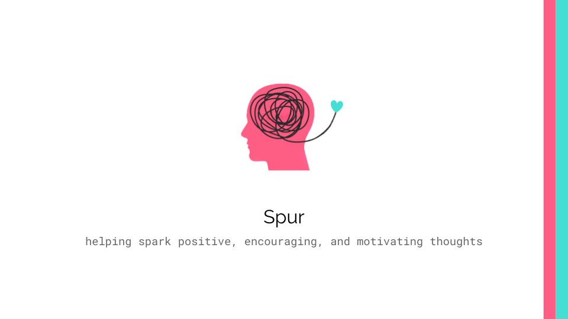

https://main.d1jnewu4gg45ad.amplifyapp.com/

# Getting Started

1. Install [Node.js](https://docs.npmjs.com/getting-started):
    
     `$ brew install node`

2. Fork and clone this repo to your local machine. To clone, enter:

     `git clone https://github.com/carlosabreuh/spur.git`
   
   CD into directory for this project in a terminal or editor of your choice.

3. Install all required dependencies:

     `$ npm install`

4. Start development mode:

    `$ npm start`
    
Open [http://localhost:3000](http://localhost:3000) to view it in the browser.

